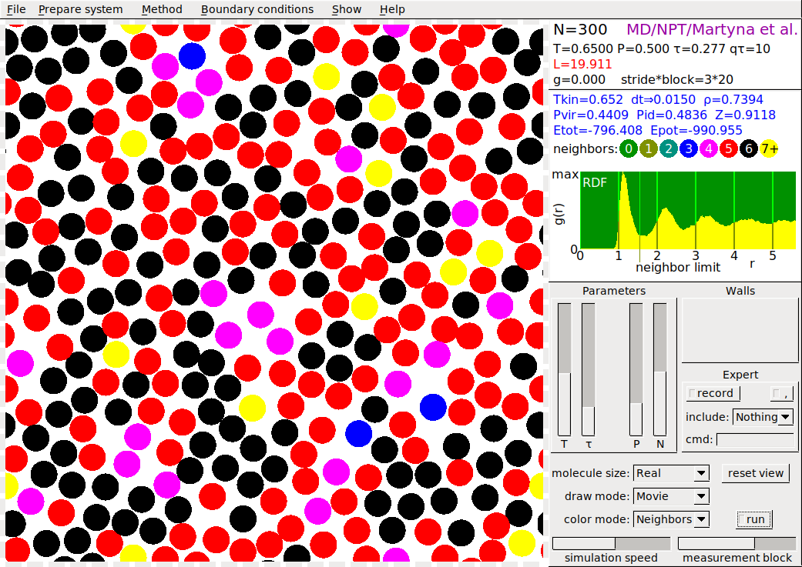

# SIMOLANT

Molecular simulation in 2D

## Aims

* _In teaching physics and chemistry at elementary and high schools:_ A number of phenomena are shown using a two-dimensional molecular model of matter:

  * Condensation of gas and crystallization of liquid on cooling
  * Melting and evaporation on heating
  * Mixing of fluids and gases
  * Capillary action
  * Crystal defects in motion
  * Gas in a gravitational field
  * Impact of a solid body (crystal) to a wall

* _In a university course of molecular simulations:_ Basic concepts of statistical thermodynamics and molecular simulations can be elucidated:

  * Ergodic and deterministic dynamic systems
  * Nucleation, Ostwald ripening
  * Molecular dynamics at constant energy and temperature
  * Metropolis and Creutz Monte Carlo
  * Convergence profile of energy to study thermostats
  * Radial distribution function and coordination number
  * Radial density profile, z-density profile
  * Walls and periodic boundary conditions
  * Flying icecube problem
  * Export of quantities incl. error estimates, convergence profiles
  * Enter parameters also from keyboard

## Licence

* [GNU General Public License 3](https://www.gnu.org/licenses/gpl-3.0.html)

## Original page

* http://old.vscht.cz/fch/software/simolant/index-en.html

## Executables (including guide)

* simolant-amd64.zip - for linux (64 bit)
* simolant-win32.zip - for Microsoft Windows (32 bit)

