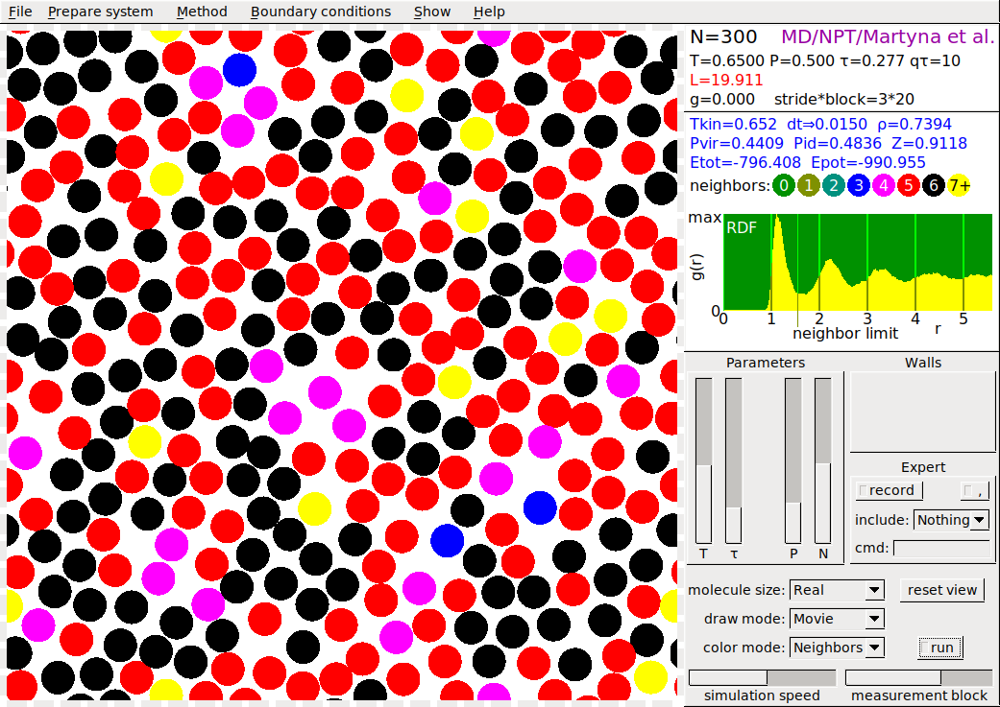

# SIMOLANT

Molecular simulation in 2D

## Aims

* _In teaching physics and chemistry at elementary and high schools:_ A number of phenomena are shown using a two-dimensional molecular model of matter:

  * Condensation of gas and crystallization of liquid on cooling
  * Melting and evaporation on heating
  * Mixing of fluids and gases
  * Capillary action
  * Crystal defects in motion
  * Gas in a gravitational field
  * Impact of a solid body (crystal) to a wall

* _In a university course of molecular simulations:_ Basic concepts of statistical thermodynamics and molecular simulations can be elucidated:

  * Ergodic and deterministic dynamic systems
  * Nucleation, Ostwald ripening
  * Molecular dynamics at constant energy / temperature / pressure
  * Monte Carlo at constant energy / temperature / pressure
  * Convergence profiles of quantities
  * Radial distribution function
  * Radial density profile, z-density profile
  * Walls and periodic boundary conditions
  * Flying icecube artifact
  * Expert: export of quantities and statistics, keyboard input

* _Student work_

  * [Verification of the Clausius-Clapeyron equation](http://old.vscht.cz/fch/en/tools/kolafa/tul/simenw1.pdf)
  * [Pressure outside a droplet/inside cavity (Kelvin equation)](http://old.vscht.cz/fch/en/tools/kolafa/simenw3.pdf)
  * Surface / interfacial tension, contact angle

## Licence

* [GNU General Public License 3](https://www.gnu.org/licenses/gpl-3.0.html)

## Original page

* http://old.vscht.cz/fch/software/simolant/index-en.html

## Executables (including simolant.html)

Create a folder (directory), extract to this folder and run from it.
_In Windows, do not run directly from "folder simolant-win32"!_

* simolant-amd64.zip - for linux (64 bit)
* simolant-win32.zip - for Microsoft Windows (32 bit)

## New in this version

* help window and panel enlarged
* Tinker menu added
* timeouts based on the measured simulation times
* new button [invert] walls
* CSV output added
* Okabe and Ito colorblind-safe palette

